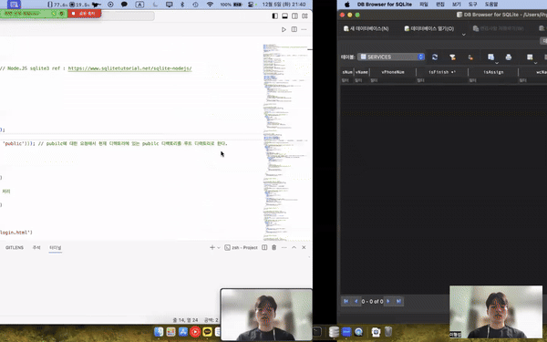

# 3_2-Database

* INU 3학년 2학기 데이터베이스 수업을 공부하며 정리한 내용.
* Velog 주소 : https://velog.io/@hseop/series/3-2-Database

## OpenAPI_Class

* 수업 중 사용한 OpenAPI를 활용한 실습 코드

## Project

* Term Project 
   ```   
   * Plan a third-party service (app/web) using Open API and your own database.
      * Use public data or Open APIs provided by Naver/Google, etc. 
      * Design and use a relational database to manage information locally 
      * Include parts that process data with SQL in the database 
      * The proposed idea and design for the new service are important
   ```

* Details in Project/
  * I used SQLite3 as a database.
  * Used OpenAPI : [보건복지부_노인돌봄서비스 기관 현황](https://www.data.go.kr/iim/api/selectAPIAcountView.do)
  * Used OpenAPI : [Kakao Map](https://apis.map.kakao.com/ios_v2/docs/)

* Result 
